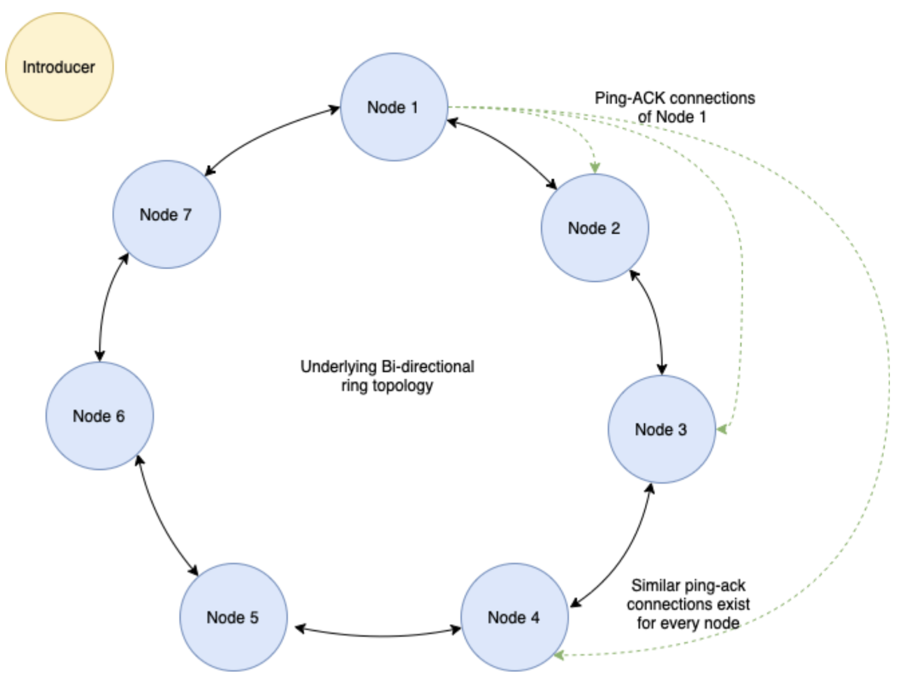

# distributed-group-membership



The distributed group membership algorithm is designed with 2 programs - an introducer program and a group membership program. The introducer program is run by a VM only for the purpose of introducing new nodes to the network. The group membership program contains logic for the unidirectional ring topology of the network (for message dissemination) and further the configuration (topology) of monitors for failure detection over the entire network. Each process’s id is created from its ip, port and time of join. 

Each node contains a full membership list but socket connections to only its direct neighbors (ring network topology) but the failures detected are disseminated through the network ring.  To account for up to 3 simultaneous failures each node in the system monitors 3 of its neighboring nodes in the clockwise direction by directly pinging them and waiting for an ACK. Each node on receiving the ACK updates the last_updated_time in the membership_list and if it’s from a new node, updates the membership list. Each node also sends its corresponding 4 monitors its own ACK for their pings and leaving_info at time of voluntary leave.

We have integrated the JAXB (Java Architecture for XML binding) format for marshaling membership data between two nodes. Before sending a packet, the sender node uses JAXB to marshal the member list Java object into a string of XML format, and the receiver node unmarshals the packet before reading it. This helps to ensure that the data is not erroneously modified as a result of differences in the underlying hardware between nodes. We chose XML as it is easy to parse, light weight and ubiquitous.


## Folder Structure

```
.
├── src/
│   ├── main/
│   │   ├── java/<...> (App code folder)
│   │   └── resources/ (config like log4j2.xml goes here)
│   └── test/ (unit tests should go here)
├── target/ (this is the build folder, contains the target JAR file of the application)
│   └── dependency/ (contains jar dependencies that are needed to run the application)
└── pom.xml (manifest/configuration of the maven project)
```

## How to run the project

### Pre-requisites

This project uses maven as the build system, and for handling dependencies. Make sure you have maven 1.8 and JDK installed on the system.

### Commands

To build & package:
```
$ mvn clean
$ mvn install
$ mvn dependency:copy-dependencies
$ mvn package
```

To run the membership protocol at each node: 
```
$ java -cp "target/group-membership-1.0-SNAPSHOT.jar:target/*" com.mp2.membership.Node
```

To run the introducer: 
```
$ java -cp "target/introducer-1.0-SNAPSHOT.jar:target/*" com.mp2.introducer.Introducer
```

To kill socket: 
```
$ lsof -i:<PORT NUM>; kill -9 <PID>
```
