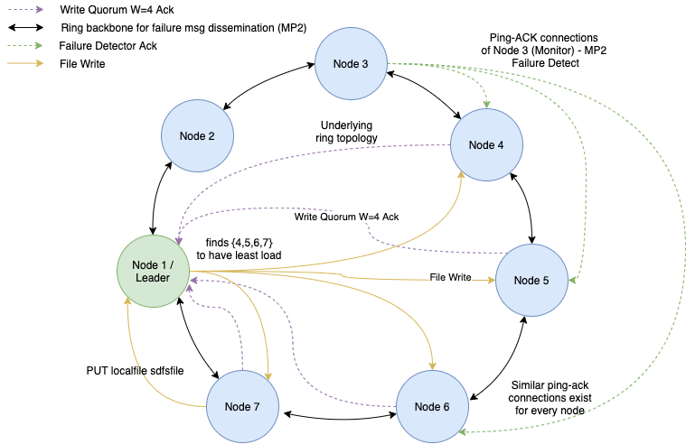

# distributed-file-system

## About

The simple distributed file system (SDFS) is designed on top of our distributed group membership protocol from MP2 where each process monitors 3 of its successor processes for failure detection. Here while implementing the SDFS we have used the same unidirectional ring topology from our MP2 that has features such as versioned file control, leader elections/re-election and data re-replication on failure while taking advantage of the membership protocol and failure detection from the last MP.

The SDFS is designed to have a leader (or coordinator) and multiple non-leader nodes (referred to as regular nodes). The leader node also works as a regular node. The regular nodes all contain a full membership list and know who the leader node is at all times when the system is healthy. Any file system query (get, put, etc) will go through the leader node to the regular nodes that contain the corresponding file being operated on. This node to data (file) mapping is present in the leader node. Basically it contains metadata about the files and decides location of new writes (which nodes to write to).



## Folder Structure

```
.

├── mp1/ (distributed grep code from MP1 used for debugging)
├── sdfs/ (mp3 code)
│   ├── input (input files used for testing)
│   ├── output (SDFS file storage goes here)
│   ├── src/main/
│   │   ├── java/<...> (App code folder)
│   │   └── resources/ (config like log4j2.xml goes here)
│   ├── src/test/ (unit tests should go here)
│   ├── target/ (this is the build folder, contains the target JAR file of the application)
│   |    └── dependency/ (contains jar dependencies that are needed to run the application)
│   └── pom.xml (manifest/configuration of the maven project)
└── setup.sh (setup script to execute on VM)
```

## How to run the project

### Pre-requisites

This project uses maven as the build system, and for handling dependencies. Make sure you have maven 1.8 and JDK installed on the system.

### Commands

To build & package:
```
$ mvn clean
$ mvn install
$ mvn dependency:copy-dependencies
$ mvn package
```

To run the SDFS code at each node: 
```
$ java -cp "target/group-membership-1.0-SNAPSHOT.jar:target/*" com.mp2.membership.Node
```

To kill socket: 
```
$ lsof -i:<PORT NUM>; kill -9 <PID>
```
