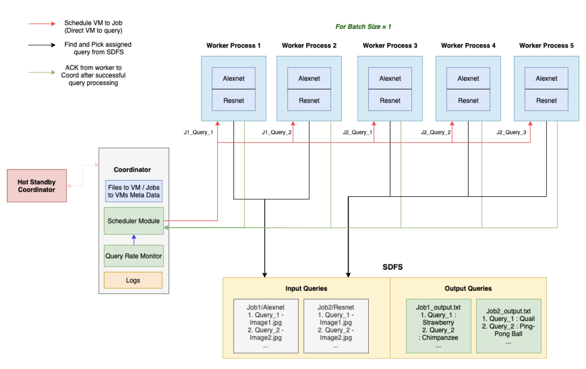

# README for IDunno

## About
The IDunno system is a distributed ML inference query processing system that processes 2 kinds of ML inference jobs asynchronously while ensuring that both jobs get fairly equal amount of resources (VMs) - such that the difference in their query processing rate is within 20%. 

## System Design


## Folder structure

```
.
├── data/ (contains test images)
├── models/ (contains pretrained Alexnet, Resnet code)
├── sdfs/ (storage folder for SDFS files)
├── *.py/ (source code for project)
└── setup.sh (script that sets up the environment to execute project on VM)
```


## Prerequisites
This project runs on python3. For the ML inference and pretraining portion, the following libraries are additional dependencies: zlib, libjpeg, pillow, torchvision

## How to run the project:

1. Execute the `setup.sh` script, which handles dependency installation and fetching the latest version of source code from git.

2. Code for coordinator has to be executed from VM 1 using the command `python3 FMaster.py`

3. Code for worker nodes can be executed from any VM using the command `python3 file_server.py`

### The following SDFS commands are supported on the worker nodes:
- put localfilename sdfsfilename
- get sdfsfilename localfilename
- delete sdfsfilename
- get_versions sdfsfilename num_versions localfilename
- ls sdfsfilename
- store

### The coordinator has a separate list of supported commands
- info (SDFS metadata)
- pending (list of queries that have not been processed yet)
- completed (list of completed queries per job/model)
- start (start processing queries)
- query_rate <model #> (get the query rate for job/model)
- query_time <model #> (get the query time for job/model)
- vm_info (To find which query is running on which VM)

## How to run the pretrained ML models

```
pip install torchvision
pip install PIL
# Inside the code, invoke either alexnet_predict(img,query_id) or resnet_predict(img,query_id)
# img - as in main.py its an 'Image' instance from PIL lib
# query_id here is redundant just a placeholder for file name or an identifier that we might need to write the output to sdfs
```
